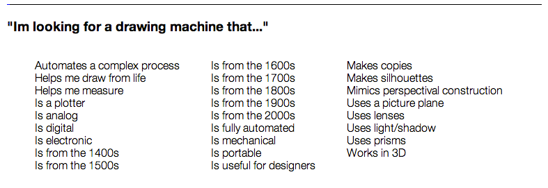
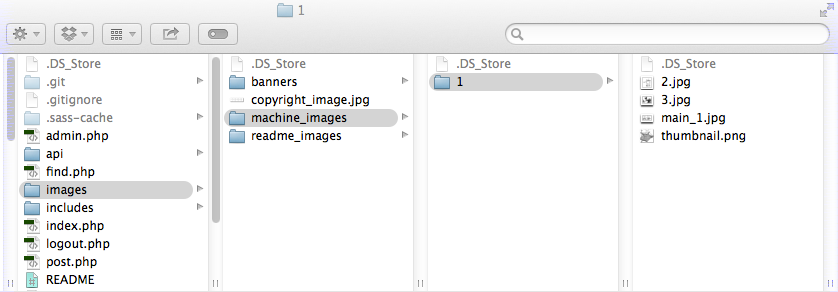

#Admin Info

The following features are coming soon:

- Search on the `find` page
- an `about` page
- working download links on `post` pages
- Admin privileges to remove categories and tags

To log in, click the `Admin` link on bottom right of the footer. Enter your username and password to be logged in. You will stay logged in on your browser for 72 hours since your last log in, or until you click the Logout button in the footer.

##Creating & Deleting Posts

###New Posts
When you enter the `Admin` page a blank machine post will be waiting for you. Filling this form in and pressing save will create a new post.

###Deleting posts
To delete a post you must first load it using its id number. This value can be found in the url bar when viewing the post on the site (e.g. `drawingmachines.org/post.php?id=14`). Once you have loaded the post, pressing the `Delete` button on the right side of the page will delete it.

##Adding #special tags

You can add special tags by prepending any tag with a `#` (e.g. `#Is digital`). This will cause it to appear on the `find` page. To assign a new post a special tag simply press the `#` key in the tags input field and a list of special tags will suggest itself. Not prepending a tag with a `#` simply means that it won't show up in the `find` page.

##Uploading Images

Uploading images is currently a pain in the ass. This system will be vastly improved soon, but for now, this is what you gotta do...

Once you have created a post, find it using the site's navigation tools and remember it's id. Create a new folder inside of the `images/machine_images/` directory. This folder's name should be the exact id of the post. Place your images inside this folder. 

You may include as many image as you like (I recommend numbering them), however the main image (the one that you see when you first load the post page) should have the word `main` somewhere in the title. Also, each post should have a thumbnail image named `thumbnail.png`

Images should be no larger than 500-600px wide to prevent slow load times. `thumbnail.png` should be 250px x 250px in size.

##Editing/adding banner images

Banner images must be 960px x 420px `.png`s. To add a banner image to the random slideshow place it in the `images/banners/` directory and name it the exact id of the post page it should link to.